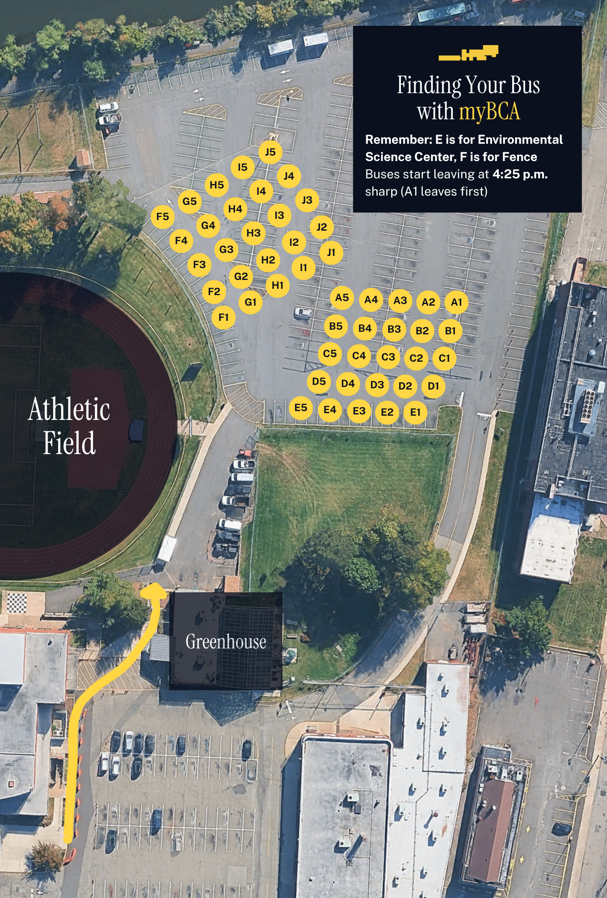

# Finding Your Bus with myBCA

Save this image to your phone (screenshot, or long press then tap "Save Image"). Scroll down for answers to some frequently asked questions about the BCA bus system.

## How do I find my bus?

* iOS: Download myBCA: <a href="https://apps.apple.com/us/app/mybca/id6756277506" target="_blank" rel="noopener noreferrer">App Store</a>
* Android and computer: Use the web version of myBCA: <a href="https://app.mybca.link" target="_blank" rel="noopener noreferrer">Web Version</a>

If you're an iOS user, you can get a notification the moment your bus arrives. Go to the Buses page and star your bus to receive notifications.

## When do buses leave?

On a normal day, 4:25 p.m. On a half day, 12:45 p.m. In the event of an emergency, the departure time of all buses may be postponed.

**Your bus cannot wait for you if you are late.**

## Which bus is first to leave?

The bus parked in A1 is first to leave. Then A2, A3, A4, A5, and then B1, B2, B3, B4, B5, and so on.
After E5 leaves, there is a short gap of time, then F1 leaves, then F2, F3, F4, F5, G1, G2, G3, G4, G5... you get the point.

## My bus shows "top" instead of a location.

That means that your bus is late and will arrive at the front of the building, rather than in the lower parking lot. Go to the front of the building (near the
auditorium entrance) to find your bus.

## My bus just arrived in the lower lot, but the other buses have already started leaving.

Wait for the first half of buses (from A1 up to E5) to leave. Then you will be allowed to cross over to the other side of the parking lot to board your bus.

## What is a bus evacuation drill?

Sometimes, the school conducts bus evacuation drills at dismissal time as required by New Jersey law. Adhere to the following procedure:
1. All students should board their buses promptly.
2. The drill leader will announce the evacuation. This is usually done by sounding an alarm over a megaphone.
3. When the evacuation begins, exit the bus through the rear emergency exit. The bus driver will assist you.
4. Re-board the bus after you evacuate.

## I need help!

Ask one of the teachers in the lower lot. They can help you find your bus, but they **cannot** help you with the myBCA app.

